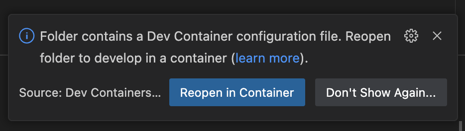
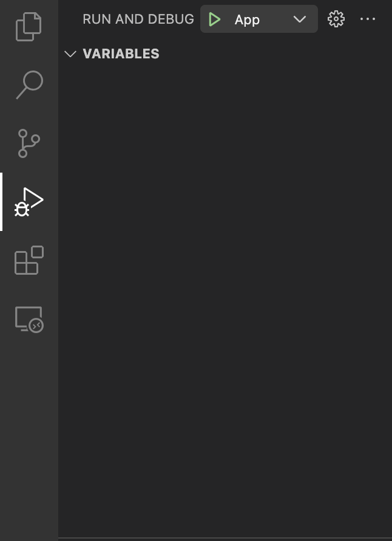
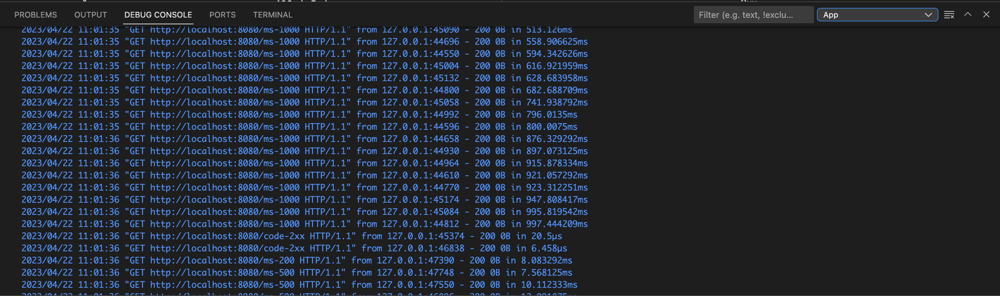

# monitoring-grafana

Окружение для курса [Мониторинг в Grafana](https://slurm.io/monitoring-grafana). Окружение состоит из приложения, которое отдает метрики, описанные в таблице, и скрипта-генератора нагрузки

| Метрика                                  | Тип        | Описание |
|------------------------------------------|------------|----------|
| http_requests_total                      | counter    | Количество обработанных http запросов |
| http_requests_inflight_current           | gauge      | Количество http запросов, которые обрабатываются прямо сейчас |
| http_requests_inflight_max               | gauge      | Максимально количество http запросов, которые могут обрабатываться "одновременно" |
| http_request_duration_seconds_historgram | historgram | Время обработки http запросов |
| http_request_duration_seconds_summary    | summary    | Время обработки http запросов |

## Requirements

- Visual Studio Code
- Docker + docker-compose

## Структура репозитория

```
├── .devcontainer - описание dev контейнера
├── .vscode - конфигурация Visual Studio Code
├── demoapp - демо-приложение, отдающее метрики
│   ├── cmd
│   │   ├── app - демо-приложение, отдающее метрики
│   │   └── load - скрипт для генерации нагрузки на демо-приложение
│   └── internal - внутренние библиотеки
│       ├── helpers - вспомогательные методы (e.g. генерация случайных http кодов)
│       ├── metrics - описание метрик
│       └── middleware - middleware для сбора метрик
├── .env - файл переменных окружения
└── docs - документация
```

## Как работать с репозиторием

1. Клонируем репозиторий и открываем его в Visual Studio Code
2. Visual Studio Code предложит открыть репозиторий внутри docker контейнера, соглашаемся и ждем 
3. После того как открылось новое окно Visual Studio Code, убеждаемся в доступности локального окружения
   1. Запускаем демо-приложение, которое должно отдавать метрики - `Run and Debug` -> `App` -> `Start debugging` (F5) 
   2. Аналогично запускаем скрипт для генераци нагрузки -  `Run and Debug` -> `Load` -> `Start debugging` (F5)
   3. Убеждаемся, что запросы пошли
   4. Убеждаемся что демо-приложение отдает метрики по адресу `localhost:8080/metrics` 

### Переменные окружения

Значение перменных окружения описаны в файле [.env](./.env). При измений значений в файле нужно перезапускать приложение (не контейнер!)

| Переменная                   | Описание                                                                               | Значение по умолчанию |
| -----------------------------| -------------------------------------------------------------------------------------- | --------------------- |
| HTTP_REQUESTS_INFLIGHT_MAX   | Максимальное количество запросов, которое приложение может обрабатывать "одновременно" | 20 |
| HTTP_REQUESTS_SUCCESSFUL_MAX | Максимальное количество запросов, которое может быть "одновременно" отправлено на эндпойнты, которые возвращают код 2xx | 15 |
| HTTP_REQUESTS_ERROR_MAX      | Максимальное количество запросов, которое может быть "одновременно" отправлено на эндпойнты, которые возвращают код >= 400 | 5 |

## Ссылки

1. [Дефолтная конфигурация prometheus](https://prometheus.io/docs/prometheus/latest/getting_started/#configuring-prometheus-to-monitor-itself)
2. [Prometheus на docker hub](https://hub.docker.com/layers/prom/prometheus/v2.43.0/images/sha256-df60172c8d9f08cadae1d79bf86525b6426c47873c712ddf0a04ed424a8c1ad4?context=explore)
3. [Grafana на docker hub](https://hub.docker.com/layers/grafana/grafana/9.5.1/images/sha256-5056e8264a8420f23838fb23c77a7bce9370161d5d90adeff47dde03b80c2e14?context=explore)
4. [Alertmanager на docker hub](https://hub.docker.com/layers/prom/alertmanager/v0.25.0/images/sha256-db8303fa05341f5dc6b19b36a97325cd1b8307254ed9042a2c554af71f3c0284?context=explore)
5. [Alertmanager configuration example](https://prometheus.io/docs/alerting/latest/configuration/#example)
6. [Receiver configuration](https://prometheus.io/docs/alerting/latest/configuration/#receiver)
7. [Telegram configuration](https://prometheus.io/docs/alerting/latest/configuration/#telegram_config)
8. [Promethues test example](https://prometheus.io/docs/prometheus/latest/configuration/unit_testing_rules/#example)
9. Команда для установки promtool - `(cd /tmp/ && curl -L https://github.com/prometheus/prometheus/releases/download/v2.45.0-rc.0/prometheus-2.45.0-rc.0.linux-amd64.tar.gz | tar -xz && sudo mv /tmp/prometheus-2.45.0-rc.0.linux-amd64/promtool /usr/local/bin/ && rm -rf /tmp/prometheus-2.45.0-rc.0.linux-amd64)`